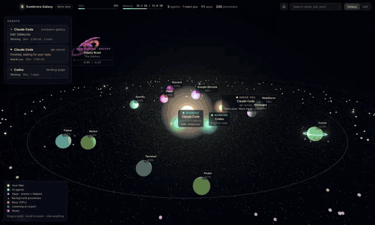
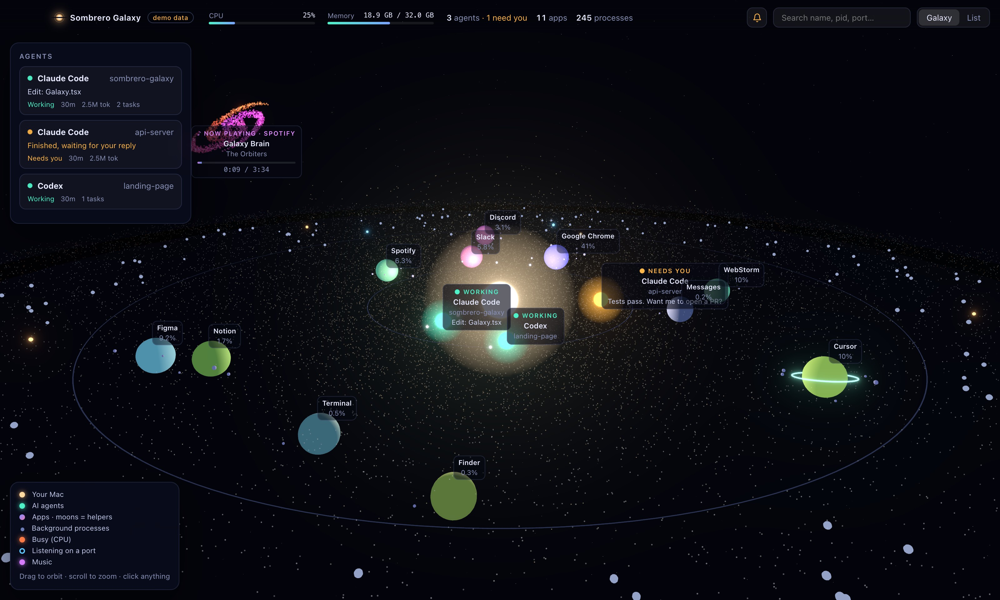
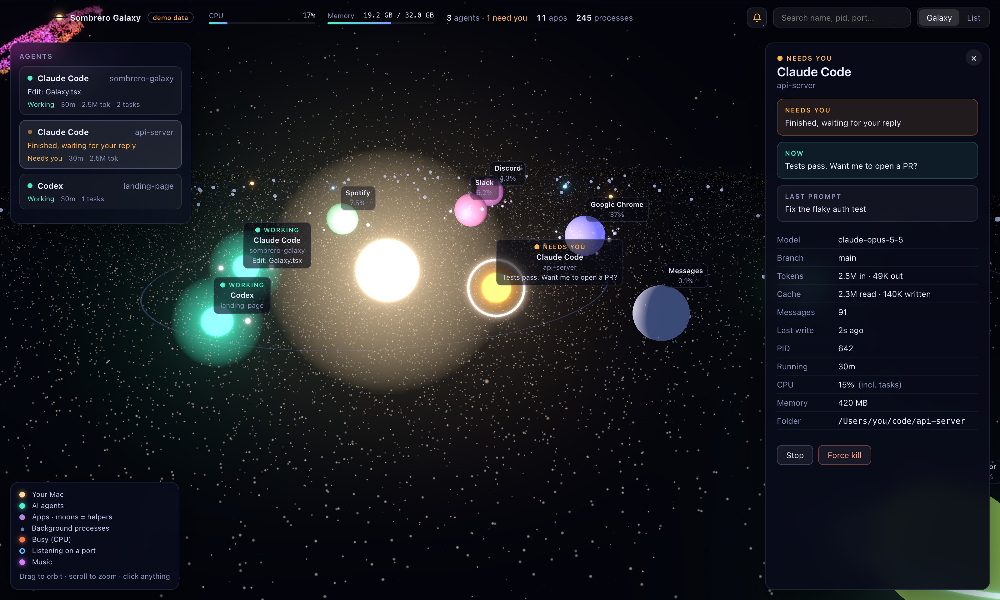
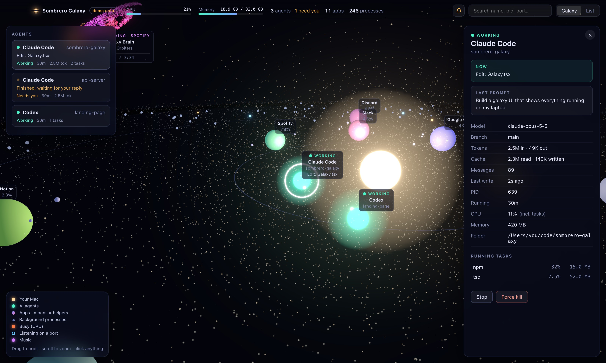
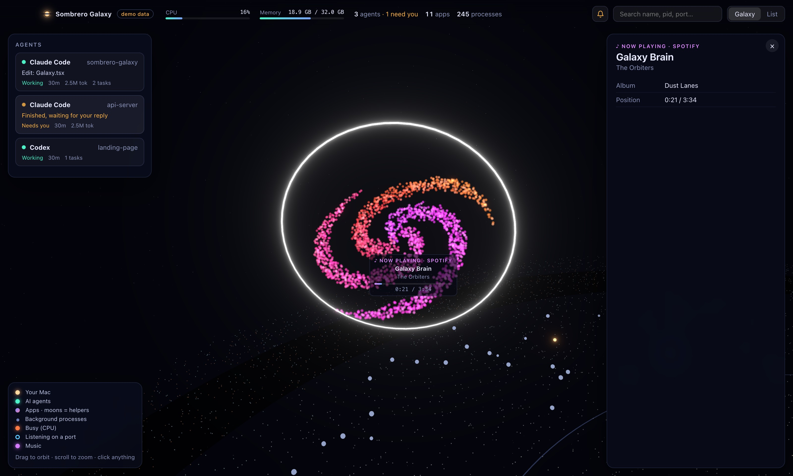
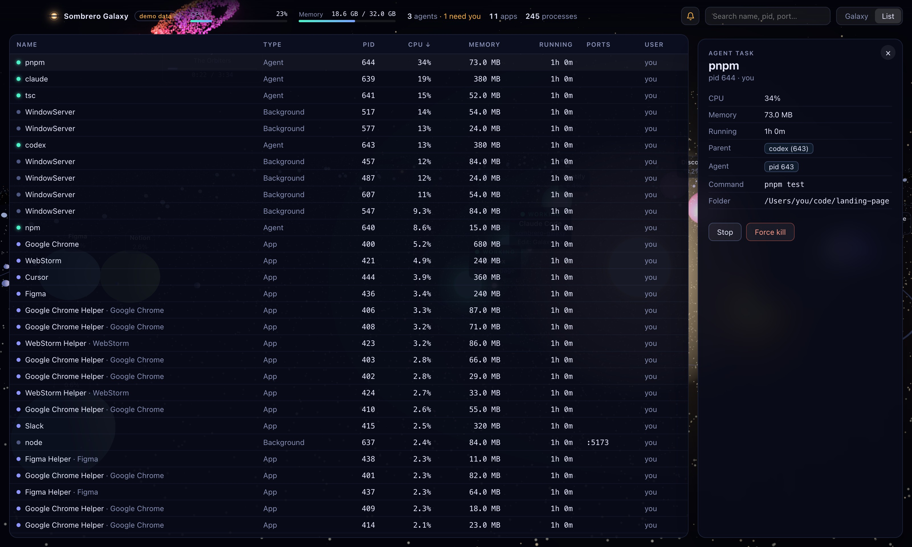
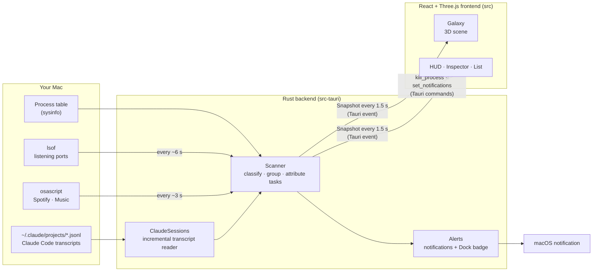

# 🌌 Sombrero Galaxy

**Activity Monitor, reimagined as a living galaxy.** Every AI agent, app, song and process on your Mac becomes a body in a 3D galaxy you can fly around. Agents are bright stars near the core, apps are planets with moons, background processes are dust in the outer disk, and whatever you're listening to is a nebula that pulses with the music. When an agent finishes or stops to ask permission, its star starts bouncing and you get a notification.

<p align="center">
  
</p>

<p align="center">
  <a href="https://thefolahan.github.io/sombrero-galaxy/"><b>▶ Try the live demo in your browser</b></a>
  &nbsp;·&nbsp; runs on built-in demo data, nothing is installed
</p>

It's a native desktop app built with [Tauri 2](https://tauri.app). A small Rust backend samples the machine every 1.5 seconds, and a React + Three.js frontend draws it. Everything stays on your computer. There's no server, no account and no telemetry.

> Inspired by [Agent Office](https://github.com/AgentSystemLabs/agent-office), which turns Claude Code workers into characters in a 3D office. Sombrero Galaxy takes the same spatial idea and points it at **your whole machine**: not only the agents you started, but everything that's running.

---

## Contents

- [What you'll see](#what-youll-see)
- [What's inside](#whats-inside)
- [Requirements](#requirements)
- [Install & run](#install--run)
- [Controls](#controls)
- [Agent detection](#agent-detection)
- [Notifications](#notifications)
- [How it works](#how-it-works)
- [Tuning](#tuning)
- [Privacy & security](#privacy--security)
- [Troubleshooting](#troubleshooting)
- [Development](#development)
- [Project structure](#project-structure)
- [Limitations & roadmap](#limitations--roadmap)
- [License](#license)

---

## What you'll see

The layout mimics the real [Sombrero Galaxy](https://en.wikipedia.org/wiki/Sombrero_Galaxy): a bright central bulge, a thin starry disk and a dark dust lane around the rim. Each zone of the disk holds a different kind of thing.

| Body | What it represents | How it's drawn |
|---|---|---|
| ☀️ **Core** | Your Mac | Glows and pulses faster as total CPU rises. Click it for system stats and the busiest processes. |
| ⭐ **Stars** (inner orbit) | AI coding agents | Colour = status: teal **working**, amber **needs you** (and bouncing), blue **idle**, violet **running** (status unknown). Small white sparks orbiting a star are the commands that agent is running right now, like `npm test` or `tsc`. |
| 🪐 **Planets** (middle disk) | Apps (`.app` bundles) | Size = memory. Glow and spin speed = CPU. Moons = helper processes (Chrome's renderers, Slack's helpers…). A **cyan ring** means the app is listening on a port. An **aurora ring** marks AI apps (Cursor, Claude, ChatGPT, Zed, Windsurf, Perplexity). |
| ✨ **Dust** (outer disk) | Background processes & daemons | One grain per process. Size = memory. Orange = busy, cyan = listening on a port, dim blue = idle. Hover for name, PID, CPU and memory. |
| 🌀 **Nebula** (above the disk) | Now playing in Spotify or Apple Music | Swirls and pulses while music plays and calms down when paused. Shows title, artist and progress. |

| Galaxy overview | An agent that needs you |
|---|---|
|  |  |
| **An agent at work, with its running tasks** | **Now playing** |
|  |  |

And when you want the boring version, **List** view is a sortable, searchable table of every process:



---

## What's inside

**Seeing everything**
- **Live 3D galaxy** of every process on the machine, refreshed every 1.5 s. Bodies keep a stable position across refreshes (placement is hashed from their name/PID), so nothing jumps around.
- **Apps grouped properly.** Chrome's 30 helper processes show up as one "Google Chrome" planet with moons, not 30 separate dots. Grouping follows the outermost `.app` bundle in each binary's path.
- **Agent task tracking.** Every process an agent spawns (shells, test runners, builds) is attributed to that agent, and its CPU and memory count toward the agent's total.
- **Dev server discovery.** Anything listening on a TCP port gets a cyan marker, and its ports show up as clickable `:5173 ↗` chips that open `http://localhost:<port>`.
- **Now playing.** Spotify and Apple Music, read via AppleScript. The players are only queried when they're already running, so this never launches them.
- **System vitals.** CPU and memory meters, plus agent, app and process counts in the top bar.

**Understanding agents** (deepest for Claude Code)
- **Status:** working, needs you, idle, or unknown.
- **Current activity:** e.g. `Edit: Galaxy.tsx`, `Bash: Run the test suite`, `Grep: TODO`, or the start of Claude's latest reply.
- **Last prompt** you gave it.
- **Model, git branch, message count**, and seconds since the transcript was last written.
- **Token usage:** input, output, cache read and cache write, summed from the session transcript.
- **Permission-prompt detection.** Claude Code waiting on "Allow this command?" is recognised as *needs you*, not *working* (see [Agent detection](#agent-detection)).

**Acting**
- **Inspector panel** for anything you click: PID, parent (clickable), user, CPU, memory, uptime, full command line, working folder, ports and child processes.
- **Stop / Force kill** (SIGTERM / SIGKILL), each needing a second click to confirm. **Quit** for apps sends SIGTERM to the app's main process.
- **Search** by name, PID, port or command. Non-matching bodies dim in the galaxy, and the list filters.
- **Notifications** when an agent needs you, a **Dock badge** counting waiting agents, and a **bell toggle** to mute. See [Notifications](#notifications).

**Feel**
- Camera glides to follow whatever you select (even as it orbits) and eases back to the core when you deselect.
- Bloom lighting, a 26,000-particle disk, 7,000 background stars, and planets lit by the core so each one has a day side and a night side.
- Frameless window: the galaxy fills it edge to edge, and the top bar doubles as the window drag handle.

---

## Requirements

| | Version | Notes |
|---|---|---|
| **macOS** | recent | App grouping, `lsof` and AppleScript music are macOS-specific (see [Limitations](#limitations--roadmap)). Developed and tested on macOS 27, Apple Silicon. |
| **Rust** | latest stable | Install with [rustup](https://rustup.rs). Developed on 1.98. |
| **Node.js** | 20+ | |
| **pnpm** | 9+ | `npm i -g pnpm`, or `corepack enable`. |
| **Xcode Command Line Tools** | any | `xcode-select --install`. Needed to compile the Rust side. |

To only look at the UI, you don't need any of this. Open the [live demo](https://thefolahan.github.io/sombrero-galaxy/).

---

## Install & run

```sh
git clone https://github.com/thefolahan/sombrero-galaxy.git
cd sombrero-galaxy
pnpm install
pnpm tauri dev
```

The first `pnpm tauri dev` compiles the Rust dependencies and takes a few minutes. After that it starts in seconds. Frontend edits hot-reload, and Rust edits rebuild and relaunch the app automatically.

### Build a standalone app

```sh
pnpm tauri build
```

This produces `src-tauri/target/release/bundle/macos/Sombrero Galaxy.app` and a `.dmg` next to it. The build isn't code-signed, so the first time you open it, right-click the app → **Open** to get past Gatekeeper.

### Browser-only mode (demo data)

```sh
pnpm dev          # → http://localhost:1420
```

Outside Tauri the frontend can't read your processes, so it switches to built-in demo data automatically (you'll see a **demo data** pill in the top bar). This is how the [live demo](https://thefolahan.github.io/sombrero-galaxy/) runs, and it's handy for UI work.

### Commands

| Command | What it does |
|---|---|
| `pnpm tauri dev` | Run the desktop app with live data and hot reload |
| `pnpm tauri build` | Build the release `.app` and `.dmg` |
| `pnpm dev` | Frontend only, in a browser, on demo data |
| `pnpm build` | Type-check and bundle the frontend into `dist/` |
| `cd src-tauri && cargo test` | Run the Rust unit tests |
| `cd src-tauri && cargo test live_snapshot -- --ignored --nocapture` | Print what the scanner sees on your machine right now (agents as JSON, apps, ports, music) |

---

## Controls

| Action | How |
|---|---|
| Orbit the camera | Drag |
| Zoom | Scroll / pinch |
| Pan | Right-drag |
| Inspect something | Click any star, planet, dust grain, the core or the nebula |
| Jump to an agent | Click its card in the **Agents** dock (top left) |
| Deselect / return to core | Click empty space, or **×** on the inspector |
| Find something | Type in the search box: name, PID, `5173`, part of a command… |
| Table view | **Galaxy / List** toggle (top right). Click column headers to sort. |
| Open a dev server | Click a `:port ↗` chip in the inspector |
| Stop a process | **Stop** then confirm (SIGTERM). **Force kill** then confirm (SIGKILL). |
| Mute notifications | Bell button in the top bar. The setting is remembered. |
| Move the window | Drag the top bar |

---

## Agent detection

### Which agents are recognised

A process is an agent if its name or command line matches one of these rules. Only processes *outside* `.app` bundles are checked, and matches are case-insensitive on the name.

| Agent | Process name | …or command line contains |
|---|---|---|
| Claude Code | `claude` | `@anthropic-ai/claude-code`, `claude-code/cli` |
| Codex | `codex` | `@openai/codex` |
| Gemini CLI | `gemini` | `@google/gemini-cli` |
| Aider | `aider` | `bin/aider` |
| OpenCode | `opencode` | `opencode-ai` |
| Goose | `goose` | |
| Amp | `amp` | `@sourcegraph/amp` |
| Copilot CLI | | `@github/copilot` |
| Cursor Agent | `cursor-agent` | |

Helper modes that aren't agents are excluded, for example `claude --chrome-native-host` (the Claude-in-Chrome bridge), `mcp serve` and `--version`.

**One agent, not three.** Many CLIs start as a `node` wrapper that launches a native binary. For every process, the scanner walks up the parent chain and assigns it to the *outermost* agent ancestor. So a wrapper and its binary count as one agent, and everything below them (shells, `npm test`, compilers) becomes that agent's **tasks**.

Adding an agent is a one-line change to `CLI_AGENTS` in [`src-tauri/src/scanner.rs`](src-tauri/src/scanner.rs).

### Claude Code: reading the transcript

Claude Code writes every session to `~/.claude/projects/<project-dir>/<session-id>.jsonl`, where `<project-dir>` is the working folder with every non-alphanumeric character replaced by `-`. Sombrero Galaxy:

1. Reads the agent process's **working directory** and finds that project's transcripts.
2. **Matches transcripts to processes.** Transcripts don't say which process wrote them, so when several Claude sessions share a folder, each transcript (newest first) goes to the session that started most recently before the transcript was created. A resumed session's file is older than its process, so that falls back to the newest unmatched session.
3. **Reads incrementally.** Only new bytes since the last tick are read, and a half-written last line is left for next time. A transcript that's tens of MB is read in full once, then followed cheaply.
4. Extracts the model, branch, token usage, last prompt and latest tool call or reply. Subagent ("sidechain") lines add to the token counts but don't affect status.

**Status rules**, from the last main-thread line in the transcript and how long ago the file was written:

| Transcript state | Status |
|---|---|
| Not written for more than 10 minutes | 💤 Idle |
| Last line is Claude's reply with `stop_reason: end_turn` | 🟠 **Needs you**: finished, waiting for your reply |
| Last line is a tool call **with nothing running under the agent, CPU < 3%, for 20+ s** | 🟠 **Needs you**: wants permission for that tool |
| Last line is a tool call (otherwise) | 🟢 Working |
| Last line is from you (a prompt or a tool result) | 🟢 Working (Claude is thinking) |
| Anything else, written in the last ~15-30 s | 🟢 Working |

The permission rule exists because a permission prompt looks identical to a running tool in the transcript: a tool call with no result yet. What gives it away is that nothing is actually happening. There's no child process and no CPU.

**Other agents** don't have a transcript to read, so their status comes from activity: CPU above 5% (including their tasks) counts as working, otherwise *running*.

---

## Notifications

When an agent starts needing you, you get a native macOS notification with the "Glass" sound:

> **Claude Code needs you · api-server**
> Wants permission: Bash: npm install

- The notification is sent from the Rust backend, so it works when the window is minimised or hidden behind other apps.
- **The Dock icon shows a badge** with the number of agents waiting on you.
- **No launch spam.** Agents that were already waiting when the app started don't trigger notifications.
- **New requests always notify**, even from an agent that was already waiting (e.g. it finished, you replied, and now it wants permission).
- **No duplicates.** The same request from the same agent won't notify again within 5 minutes, even if its status flickers.
- **Mute** with the bell in the top bar. The setting is stored locally and applied on launch.

macOS asks for notification permission the first time. If you missed it, see [Troubleshooting](#troubleshooting).

---

## How it works



**Every tick (1.5 s), on a background thread:**

1. **Sample** all processes with [`sysinfo`](https://crates.io/crates/sysinfo): CPU, memory, command line, executable path, working directory, user and parent. Command lines, paths and working directories are fetched once per process and cached.
2. **Classify** each process:
   - **App** if its executable lives in a user-facing `.app` bundle under `/Applications`, `/System/Applications`, `~/Applications` or Finder. Bundles buried in `/System/Library` (ControlCenter, XPC services…) count as background. That's what they are to you.
   - **Agent** if it matches the table above, or descends from something that does.
   - **Background** otherwise.
3. **Ports** from `lsof -nP -iTCP -sTCP:LISTEN` (every 4th tick) and **music** from AppleScript (every 2nd tick). These spawn subprocesses, so they run less often.
4. **Claude sessions** are resolved and their transcripts read incrementally.
5. **Alerts** compare each agent's "needs you" reason with the previous tick and fire notifications.
6. The whole **`Snapshot`** is emitted to the frontend as a Tauri event and kept for the `get_snapshot` command, so a freshly loaded window draws immediately.

**The frontend** turns each snapshot into a scene with [React Three Fiber](https://r3f.docs.pmnd.rs):
- Apps are grouped by bundle, and each app's main process is the one whose parent is outside the bundle.
- Every body's orbit (radius, phase, speed, tilt) comes from a hash of its identity, so positions stay put between ticks while the numbers change.
- Background processes are a single `InstancedMesh`, one draw call for hundreds of processes, with per-instance colour and hover and click picking.
- Labels are DOM overlays (`@react-three/drei`'s `Html`), so they stay crisp and readable at any zoom.
- Glow comes from `@react-three/postprocessing` bloom on HDR colours.

**Commands exposed to the UI** (`src-tauri/src/lib.rs`):

| Command | Purpose |
|---|---|
| `get_snapshot()` | Latest snapshot, for the first paint |
| `kill_process(pid, force)` | SIGTERM, or SIGKILL when `force`. Refuses PID ≤ 1 and the app itself. |
| `set_notifications(enabled)` | Mute or unmute "needs you" notifications |

The snapshot's shape is defined once in Rust ([`model.rs`](src-tauri/src/model.rs)) and mirrored in TypeScript ([`types.ts`](src/types.ts)).

---

## Tuning

These constants are the main knobs:

| Constant | Default | File | Effect |
|---|---|---|---|
| `TICK` | 1.5 s | `src-tauri/src/lib.rs` | How often the machine is sampled |
| Ports / music cadence | every 4th / 2nd tick | `src-tauri/src/scanner.rs` (`sample`) | How often `lsof` / AppleScript run |
| `PERMISSION_STALL_SECS` | 20 s | `src-tauri/src/scanner.rs` | How long a tool call can hang with nothing running before it's called a permission prompt |
| `REPEAT_AFTER` | 5 min | `src-tauri/src/alerts.rs` | Minimum gap before the same request notifies again |
| Idle threshold | 10 min | `src-tauri/src/claude.rs` (`update`) | Transcript silence before an agent is "idle" |
| `CLI_AGENTS` | see table | `src-tauri/src/scanner.rs` | Which processes count as agents |
| `AI_APPS` | Cursor, Claude, ChatGPT… | `src/lib/groups.ts` | Which apps get the aurora ring |
| `RINGS` | agents 5.5-9.5, apps 13-29, dust 32-46 | `src/galaxy/shared.ts` | Radius of each zone of the galaxy |

---

## Privacy & security

- **Everything is local.** The app makes no network requests. The live demo runs entirely on fake data in your browser.
- **Read-only on your data.** Claude Code transcripts are only read, never modified. Token counts and prompts are shown in the app and aren't stored anywhere else.
- **Ordinary user permissions.** No root, no helper daemon, no kernel extension. Stop / Force kill can only signal processes you own, and system or other-user processes return a clear error. PID 1 and Sombrero Galaxy itself are always refused.
- **Two-click kills.** Every destructive button needs a confirmation click within 3 seconds.
- **macOS prompts you may see:** *Notifications* (for agent alerts) and *Automation → Spotify / Music* (to read what's playing). Both are optional, and the app works without them.
- **Tauri capabilities** are kept minimal: core defaults, window dragging and the opener plugin (for `http://localhost` links).

---

## Troubleshooting

**The galaxy is black / empty for a moment on launch**
The first frame waits for shaders to compile and for the first snapshot, so there can be a short pause. In a *browser tab* that's in the background, rendering pauses entirely until the tab is visible. That's normal browser behaviour.

**An agent shows "Running" instead of "Working" / "Needs you"**
For Claude Code, it has no transcript yet (it appears after the first message), or its working directory couldn't be read. For other agents, this is expected: status comes from CPU activity only.

**Two Claude sessions in the same folder show each other's activity**
Transcript-to-process matching is inferred from start times (see [above](#claude-code-reading-the-transcript)), which can occasionally pair them the wrong way round. Restarting one of the sessions sorts it out.

**No notifications**
Check *System Settings → Notifications*. In development (`pnpm tauri dev`), macOS may list them under your terminal app rather than "Sombrero Galaxy". Also check that the bell in the top bar isn't muted.

**The music nebula never appears**
Only Spotify and Apple Music are supported, and only while running. If you declined the *Automation* prompt, re-enable it under *System Settings → Privacy & Security → Automation*.

**"Could not signal <pid>"**
The process belongs to another user or to the system. Sombrero Galaxy runs without elevated privileges on purpose.

---

## Development

```sh
pnpm install
pnpm tauri dev                                         # live app
pnpm dev                                               # browser + demo data
npx tsc --noEmit                                       # type-check the frontend
cd src-tauri && cargo test                             # unit tests
cd src-tauri && cargo test live_snapshot -- --ignored --nocapture   # dump a real scan
```

The Rust tests cover:
- app bundle detection, e.g. Chrome's nested helper bundles resolve to "Google Chrome"
- agent matching and helper-mode exclusion
- Claude Code's project-directory naming
- the notification rules: no replay at launch, new requests notify, flicker is suppressed, mute is respected

The browser demo is generated by [`src/lib/demo.ts`](src/lib/demo.ts). Edit it to preview situations you can't easily reproduce, like ten agents or a machine at 100% CPU.

The live demo is deployed to GitHub Pages by [`.github/workflows/pages.yml`](.github/workflows/pages.yml) on every push to `main`.

---

## Project structure

```
sombrero-galaxy/
├── src/                        React + Three.js frontend
│   ├── App.tsx                 Layout, selection & camera-focus state
│   ├── types.ts                Snapshot types (mirror of model.rs)
│   ├── galaxy/
│   │   ├── Galaxy.tsx          Canvas, camera rig, bloom, scene assembly
│   │   ├── Bodies.tsx          Core, agent stars, app planets, music nebula
│   │   ├── ProcessField.tsx    Background processes as one instanced mesh
│   │   ├── Backdrop.tsx        The Sombrero disk, bulge and dust lane
│   │   └── shared.ts           Orbits, colours, zone radii, body registry
│   ├── ui/
│   │   ├── Hud.tsx             Top bar, agent dock, legend
│   │   ├── Inspector.tsx       Details panel + stop/kill
│   │   ├── ListView.tsx        Sortable process table
│   │   └── actions.ts          kill / open-port bridges to Rust
│   └── lib/
│       ├── useSnapshot.ts      Live data (or demo data in a browser)
│       ├── useNotifications.ts Bell toggle, persisted and mirrored to Rust
│       ├── groups.ts           App grouping, stable hashing, search
│       ├── demo.ts             Demo data generator
│       └── format.ts           Bytes, durations, token counts
├── src-tauri/                  Rust backend
│   ├── src/
│   │   ├── lib.rs              App setup, sampling loop, commands
│   │   ├── scanner.rs          Process sampling & classification
│   │   ├── claude.rs           Claude Code transcript reader
│   │   ├── alerts.rs           Notifications & Dock badge
│   │   ├── music.rs            Spotify / Apple Music via AppleScript
│   │   ├── ports.rs            Listening ports via lsof
│   │   └── model.rs            Snapshot data model
│   └── tauri.conf.json         Window & bundle config
├── docs/media/                 Screenshots & preview GIF
└── .github/workflows/pages.yml Live demo deployment
```

---

## Limitations & roadmap

**Known limitations**
- **macOS only for now.** Process sampling (`sysinfo`) is cross-platform, but app grouping, ports (`lsof`) and music (AppleScript) are macOS-specific. The frontend is platform-neutral.
- **Status beyond Claude Code is coarse.** Other agents are working or running based on CPU alone.
- **Permission detection is inferred.** A tool that runs inside Claude itself (like a slow web fetch) for over 20 s with no child process can trigger a false "wants permission".
- **Music is Spotify and Apple Music only.** Browser tabs (YouTube, SoundCloud) aren't detected.
- **Clicking a notification doesn't jump to the agent.** The notification plugin doesn't support click actions on macOS.

**Ideas**
- [ ] Estimated $ cost per agent and per day
- [ ] Transcript-level status for Codex and Gemini CLI
- [ ] Launch new agents from inside the galaxy, with a live terminal (à la Agent Office)
- [ ] Network activity as light trails between bodies
- [ ] CPU / memory history sparklines in the inspector
- [ ] Windows and Linux support
- [ ] Browser media via the system Now Playing API

Contributions and ideas are welcome. Open an issue or a PR.

---

## License

[MIT](LICENSE) © 2026 Omisakin Joshua
